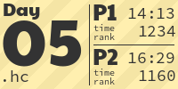

# AoC Tiles

This script creates a graphic for each day for each year of the Advent of Code. 
A tile is an image which represents both parts of a day, it looks like this:


It uses the personal [AoC Leaderboard](https://adventofcode.com/2021/leaderboard/self) to get the data for each day using your cookie. 


## Installation

Feel free to use it, here is a short description of how to get it working:

Copy this entire folder into your AoC repository. Then install the requirements.

### Requirements

Install at least Python 3.10 (because of the new typing union `|`, if you cannot do so you can
change the `type1 | type2` annotations to `Union[type1, type2]`).

Install the requirements (`pillow` for creating images, `requests` for the leaderboard data and `pyyaml` to parse the language config):

```
pip install -r requirements.txt
```

### Configuration

To use this script, you need to have a file named "session.cookie" in the same folder as this script.
It should contain a single line, the "session" cookie from https://adventofcode.com when you are logged in. 
No prefix is needed, only the string of length 128.

Now add `<!-- AOC TILES BEGIN -->` and  `<!-- AOC TILES END -->` in your README, everything between these 2 tags
will always be replaced by the script, so do not add additional information there. Note that these are HTML comments, 
so they will not be visible in the rendered README.

Your year/day script structure likely looks different. You can change the patterns for years and days in the 
[create_aoc_tiles.py](create_aoc_tiles.py) file.

The variables at the top of the script have comments to explain what they do.

To try whether it works you can run the script directly:

```
python3 create_aoc_tiles.py
```

### Pre-commit hook

Add [.pre-commit-config.yaml](/.pre-commit-config.yaml) to your repository and run `pre-commit install` to install the hook.


## Customization

There are various flags and variables which can be set to change the look of your tiles. Some of them are listed here
with examples showing how it changes the look.

**Note that in order to regenerate images you have to either delete the images or delete the .aoc-tiles-cache!**

* `SHOW_CHECKMARK_INSTEAD_OF_TIME_RANK`:

| `False` (default)           | `True`                         |
|---------------------------|--------------------------------|
|  |  |

* `CONTRAST_IMPROVEMENT_TYPE`:

| `"outline"` (default)          | `"dark"`                 | `"none"`                 |
|-----------------------------|--------------------------|--------------------------|
|  |  |  |
