<!-- AOC TILES BEGIN -->
<h1 align="center">
  Advent of Code - 230/470 ⭐
</h1>
<h1 align="center">
  2024 - 20 ⭐ - Python
</h1>
<a href="2024/01/01.py">
  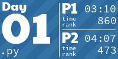
</a>
<a href="2024/02/02.py">
  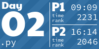
</a>
<a href="2024/03/03.py">
  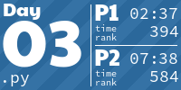
</a>
<a href="2024/04/04.py">
  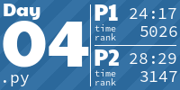
</a>
<a href="2024/05/05.py">
  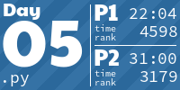
</a>
<a href="2024/06/06.py">
  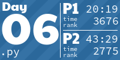
</a>
<a href="2024/07/07.py">
  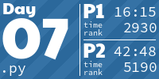
</a>
<a href="2024/08/08.py">
  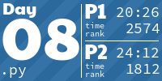
</a>
<a href="2024/09/09.py">
  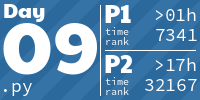
</a>

<h1 align="center">
  2023 - 50 ⭐ - Python
</h1>

<a href="2023/02/02.py">
  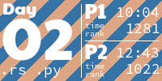
</a>
<a href="2023/03/03.py">
  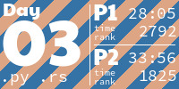
</a>
<a href="2023/04/04.py">
  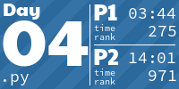
</a>
<a href="2023/05/05.py">
  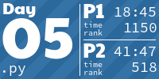
</a>
<a href="2023/06/06.py">
  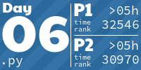
</a>
<a href="2023/07/07.py">
  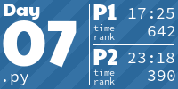
</a>
<a href="2023/08/08.py">
  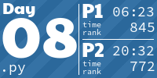
</a>

<a href="2023/11/11.py">
  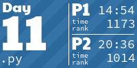
</a>
<a href="2023/12/12.py">
  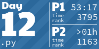
</a>
<a href="2023/13/13.py">
  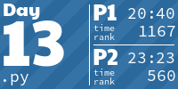
</a>
<a href="2023/14/14.py">
  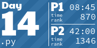
</a>
<a href="2023/15/15.py">
  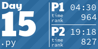
</a>
<a href="2023/16/16.py">
  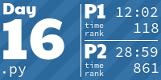
</a>
<a href="2023/17/17.py">
  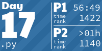
</a>
<a href="2023/18/18.py">
  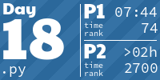
</a>
<a href="2023/19/19.py">
  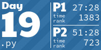
</a>
<a href="2023/20/20.py">
  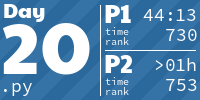
</a>

<a href="2023/22/22.py">
  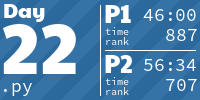
</a>
<a href="2023/23/23.py">
  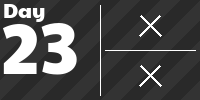
</a>
<a href="2023/24/24.py">
  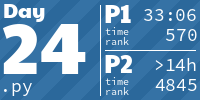
</a>
<a href="2023/25/25.py">
  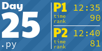
</a>
<h1 align="center">
  2022 - 50 ⭐ - Kotlin
</h1>

<a href="2022/02/02.kt">
  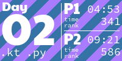
</a>

<a href="2022/06/06.kt">
  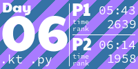
</a>

<a href="2022/11/11.kt">
  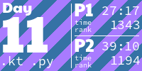
</a>

<a href="2022/13/13.kt">
  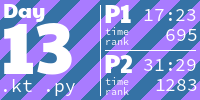
</a>
<a href="2022/14/14.kt">
  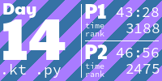
</a>

<a href="2022/16/16.kt">
  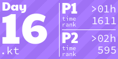
</a>
<a href="2022/17/17.kt">
  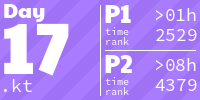
</a>
<a href="2022/18/18.kt">
  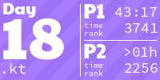
</a>
<a href="2022/19/19.kt">
  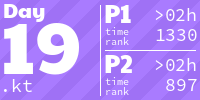
</a>
<a href="2022/20/20.kt">
  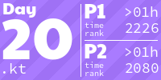
</a>
<a href="2022/21/21.kt">
  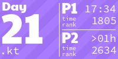
</a>
<a href="2022/22/22.kt">
  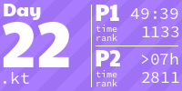
</a>
<a href="2022/23/23.kt">
  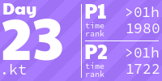
</a>
<a href="2022/24/24.kt">
  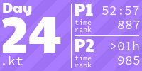
</a>
<a href="2022/25/25.kt">
  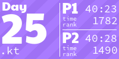
</a>
<h1 align="center">
  2021 - 50 ⭐ - Julia
</h1>

<a href="2021/02/2.jl">
  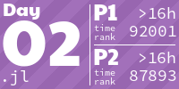
</a>
<a href="2021/03/3.jl">
  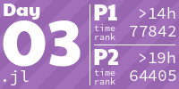
</a>
<a href="2021/04/4.jl">
  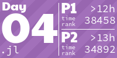
</a>
<a href="2021/05/5.jl">
  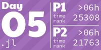
</a>

<a href="2021/07/7.jl">
  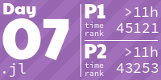
</a>

<h1 align="center">
  2020 - 50 ⭐ - Rust
</h1>

<h1 align="center">
  2019 - 10 ⭐ - OCaml
</h1>

<!-- AOC TILES END -->

*The above tiles are clickable, leading to the solution of the corresponding day.*

---

The graphic above has been created using [aoc_tiles](https://github.com/LiquidFun/aoc_tiles). Feel free to use it, it's easy to set up!

---

My solutions:

* are self-contained and use no util files and mostly no libraries. 
* are written in a very concise and functional style (only 5/100 solutions have >=70 loc as calculated by `cloc`)
* try to be (too) clever, this is not code written for readability, but for pushing language expressibility.
* solve both parts of each problem at once. I believe structuring the code so that it solves both parts is often an interesting challenge.
* expect input via `stdin` and output (generally) 2 lines to `stdout` with the answer to part 1 and part 2.
* (generally) parse input as it is given without modifying or pasting it into the code as an array. Parsing the strings in as little code as possible is a huge part of AoC.

and are written in a different programming language each year:

* **2023**: Initially I wanted to use Rust for this year, but instead I focused on getting on the leaderboard with **Python** (successfully on day 18 and 25!). In the last days I even started using libraries (Z3/networkx). Python is my strongest language, so no surprises there. I did 5 days in Rust as well, but found it too frustrating and had too little time for 2 solutions per day.
* **2022**: Using **Kotlin** for the first time. Playing with streams a lot, many days are completed by only using streams. The first 15 days have **Python** solutions as well in order to be able to submit quicker and get better times on the leaderboard.
* **2021**: Using **Julia** for the first time. Because it supports numpy-like element-wise operations natively this was a great choice for AoC. If I used more Julia it would likely be my go to language for AoC right now.
* **2020**: Using **Rust** for the first time. Solved 8 days initially. Revisited in 2024 and solved all of them. This time I liked Rust much more. I ended up writing very concise and functional Rust. After getting used to it it was quite fun. All rust solutions are below 100 loc (as calculated by `cloc`).

Not part of the repository yet, since these are incomplete and the code is not good (might revisit them later):

* **2019**: First time participating, solved 5 days with **Python**. Trying OCaml in 2024.

---

### Running 

* 2023: `python 01.py < input.in` with Python 3.12
* 2022: `kotlinc 01.kt -include-runtime -d 01.jar && kotlin 01.jar < example.in` (or use intellij, kotlinc is very slow via CLI, 5+ seconds to compile)
* 2021: `julia 1.jl < input.in`
* 2020: `cargo run --release --bin 01 < input.in` or with autoresolve current dir, auto-refresh and time-taken: `cargo watch -s 'time cargo run --release --bin '$(basename $PWD)' < '$(basename $PWD)'/input.in'` with Rust version 1.80.1
* 2019: `ocaml 01.ml < input.in` with OCaml 5.2.0

In order to test the programs you can pipe the input to the program, for example: `julia 1.jl < input.in`. The correct output is saved in the `input.ans`. Instead of doing this manually, I use my `program-tester.sh` script (see [here](https://github.com/LiquidFun/misc-scripts)), which runs the given program on all `*.in` files in the directory, and tests whether the corresponding `*.ans` file matches the given output. I have mapped that program on `Enter` in vim, which makes testing programs easy. 

Programs are initialized with the `init-day.sh` script. I.e. typing `init-day.sh 10` initializes the 10th day by creating a folder named `10` and downloading the input test case with the `session.cookie`.

My favorite solution [2023/18](2023/18/18.py)

