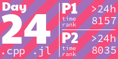

<h1 align="center">
  My Advent of Code Solutions
</h1>

<!-- AOC TILES BEGIN -->
<h1 align="center">
  2022
</h1>
<h1 align="center">
  2021
</h1>

<!-- AOC TILES END -->

---

The graphic above has been created with [this](create_aoc_tiles.py) script. Feel free to use it in your own repositories.

---

All solutions expect the input via stdin, which can be easily achieved by piping the input to the program: `julia 1.jl < input.in`. I use the `program-tester.sh` script (see [here](https://github.com/LiquidFun/misc-scripts)), which runs the given program on all `*.in` files in the directory, and tests whether the corresponding `*.ans` file matches the given output. Each program outputs both part 1 and part 2 on separate lines. To validate a program manually, type `diff <(julia 1.jl < input.in) input.ans`.

Programs are initialized with the `init-day.sh` script. I.e. typing `init-day.sh 10` initializes the 10th day by creating a folder named `10`, downloading the input test case with the `session.cookie`, copying the `dummy.py` file and opening the solution file.

* 2021: There is a solution for each problem in Julia. Sometimes there is a Python or APL solution as well. I'm trying out Julia for the first time, mostly focusing on short and elegant code. 

