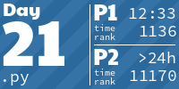
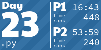

<!-- AOC TILES BEGIN -->
<h1 align="center">
  Advent of Code - 188/450 ⭐
</h1>
<h1 align="center">
  2023 - 50 ⭐
</h1>

<h1 align="center">
  2022 - 50 ⭐
</h1>

<h1 align="center">
  2021 - 50 ⭐
</h1>

<h1 align="center">
  2020 - 38 ⭐
</h1>

<!-- AOC TILES END -->

*The above tiles are clickable, leading to the solution of the corresponding day.*

---

The graphic above has been created using [aoc_tiles](https://github.com/LiquidFun/aoc_tiles). Feel free to use it, it's easy to set up!

---

All of my solutions are self-contained and use no util files (and mostly no libraries). I try to golf the solutions a little after getting the stars, while still maintaining some readability. The combination of these factors means they're rather short and generally quite elegant (e.g. [2023/18](2023/18/18.py)). The solutions expect the input via `stdin` and print (generally) 2 lines to `stdout` with the answer to part 1 and part 2. Exceptions to this are the solutions which require you to read some letters from ASCII art, in that case the ASCII art is part of the `.ans` file and it is printed by the solution instead of the letters.

* **2023**: Initially I wanted to use Rust for this year, but instead I focused on getting on the leaderboard with **Python** (successfully on day 18 and 25!). In the last days I even started using libraries (Z3/networkx). Python is my strongest language, so no surprises there, I did 5 days in Rust as well, but found it too frustrating and had too little time for 2 solutions per day.
* **2022**: Using **Kotlin** for the first time. Playing with streams a lot, many days are completed by only using streams. The first 15 days have **Python** solutions as well in order to be able to submit quicker and get better times on the leaderboard.
* **2021**: Using **Julia** for the first time. Because it supports numpy-like element-wise operations natively this was a great choice for AoC. If I used more Julia it would likely be my go to language for AoC right now.

Not part of the repository yet, since these are incomplete and the code is not good (might revisit them later):

* **2020**: Using **Rust** for the first time. Solved 8 days, however I found Rust was too verbose and too safe for AoC.
* **2019**: First time participating, solved 5 days with **Python**

In order to test the programs you can pipe the input to the program, for example: `julia 1.jl < input.in`. The correct output is saved in the `input.ans`. Instead of doing this manually, I use my `program-tester.sh` script (see [here](https://github.com/LiquidFun/misc-scripts)), which runs the given program on all `*.in` files in the directory, and tests whether the corresponding `*.ans` file matches the given output. I have mapped that program on `Enter` in vim, which makes testing programs easy. 

Programs are initialized with the `init-day.sh` script. I.e. typing `init-day.sh 10` initializes the 10th day by creating a folder named `10` and downloading the input test case with the `session.cookie`.

